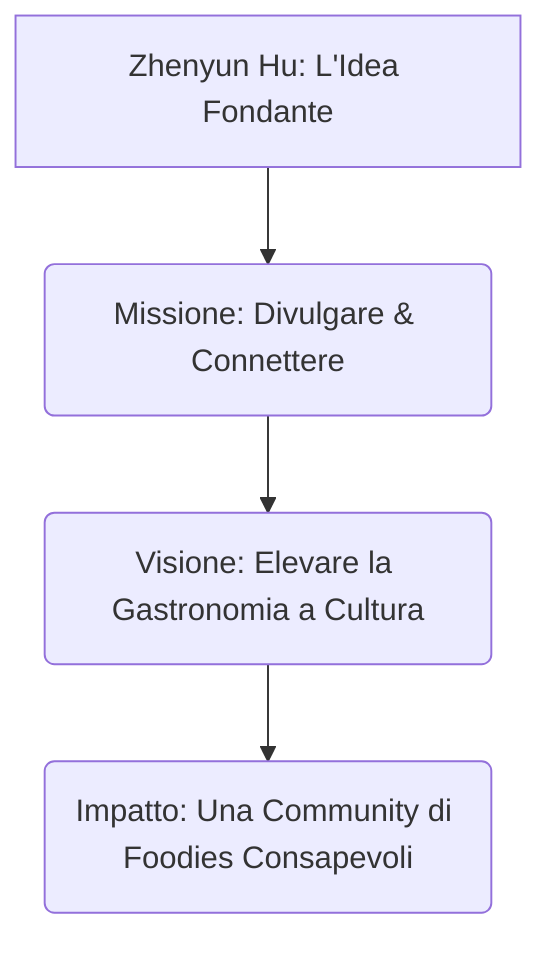

# 🏛️ Brandbook: Identità del Brand e Progetto

> *"Svelare l'anima del cibo significa riconnetterci con la nostra storia, capendo che ogni boccone racchiude secoli di migrazioni, scoperte scientifiche ed espressioni artistiche."*
> — **Zhenyun Hu**, Creatore di Sapori Svelati

Questo documento definisce il cuore filosofico di **Sapori Svelati**. Ne delinea l'identità fondamentale, la visione sul lungo periodo, la missione quotidiana e i valori etici ed estetici che ne guidano ogni pubblicazione ed interazione.

---

## 1. Cos'è il Progetto "Sapori Svelati"

Fondato da **Zhenyun Hu**, **Sapori Svelati** nasce come un blog gastronomico premium e un hub culturale indipendente. Non si tratta di un semplice raccoglitore di ricette o di recensioni di ristoranti; è un **progetto di divulgazione narrativa e antropologica** dedicato al mondo del cibo e della mixology.

Il progetto nasce da un'osservazione fondamentale: nella frenesia del consumo moderno, abbiamo perso il contatto con la storia degli alimenti che consumiamo quotidianamente. Mangiamo Wagyu, beviamo un Dry Martini o utilizziamo spezie esotiche senza conoscere le incredibili storie di sopravvivenza, le scoperte scientifiche accidentali o le rotte commerciali sanguinose che hanno portato quegli elementi sulle nostre tavole.

**Sapori Svelati** colma questo vuoto, agendo come un "lente d'ingrandimento" culturale che *svela le storie celate dietro il sapore*.

---

## 2. Visione & Missione

### La Visione (Il Sogno a Lungo Termine)
Diventare il punto di riferimento italiano per la divulgazione enogastronomica di alto livello, ridefinendo il modo in cui le persone vivono il cibo. Vogliamo che il pasto non sia più percepito solo come un atto biologico o un'esperienza edonistica momentanea, ma come un **atto culturale consapevole** ed un momento di arricchimento intellettuale.

### La Missione (Il Nostro Impegno Quotidiano)
Rendere accessibile, affascinante e rigorosa la storia della gastronomia globale attraverso la potenza dello **storytelling narrativo**.
Uniamo la ricerca storica archivistica, la spiegazione scientifica dei fenomeni chimico-fisici e il racconto avvincente delle tradizioni popolari, offrendo articoli gratuiti, inclusivi e ad altissima accessibilità tecnologica.

---

## 3. I Valori Fondamentali del Brand

I quattro pilastri etici ed estetici definiti dal fondatore Zhenyun Hu:

| Valore | Descrizione | Come si esprime nel concreto |
| :--- | :--- | :--- |
| **1. Autorevolezza Rigorosa** | Ogni informazione storica, antropologica o scientifica deve essere verificata su fonti attendibili. | Zero fake news gastronomiche. Citazione delle scoperte reali e delle nozioni certificate (es. i passaggi ufficiali IBA per il Dry Martini). |
| **2. Raffinatezza Estetica** | Il cibo è arte, e merita di essere presentato in un contenitore artistico. | Layout caldo e pulito, uso sapiente dello spazio bianco, immagini d'archivio suggestive e scrittura dal ritmo lirico. |
| **3. Accessibilità e Inclusione** | La cultura del cibo appartiene a tutti, senza barriere fisiche, economiche o tecnologiche. | Codice privo di framework pesanti, caricamento immediato su dispositivi economici, compatibilità completa con screen reader (Skip links, ARIA). |
| **4. Storytelling Coinvolgente** | La scienza e la storia non devono essere noiose o accademiche, ma devono emozionare. | Articoli scritti in forma di viaggio narrativo, con personaggi storici reali e descrizioni sensoriali immersive. |

---

## 4. Il Manifesto di Sapori Svelati

1.  **Il cibo ha un'anima**: Dietro ogni piatto c'è una mente che lo ha pensato, una terra che lo ha nutrito e un viaggio che lo ha trasportato. Noi sveliamo quest'anima.
2.  **La chimica sposa la tradizione**: Rispettiamo i riti antichi ma amiamo spiegare perché avvengono (es. la reazione di Maillard nella marezzatura del Wagyu). La scienza non toglie magia al cibo, la amplifica.
3.  **L'eleganza della semplicità**: Preferiamo la purezza degli ingredienti e del codice web. Bandiamo il superfluo per lasciare spazio all'essenziale.
4.  **Una tavola senza confini**: Esploriamo con uguale entusiasmo la piadina romagnola e il melone Yubari King giapponese. La gastronomia è il più grande ponte culturale dell'umanità.

---

## Conclusioni sull'Identità

> [!IMPORTANT]
> **Il Ruolo di Zhenyun Hu:**
> Come fondatore e direttore editoriale, Zhenyun Hu garantisce che il progetto non perda mai la sua direzione etica: unire la qualità visiva digitale all'eccellenza editoriale. Sapori Svelati non vende prodotti, ma diffonde consapevolezza culturale.
